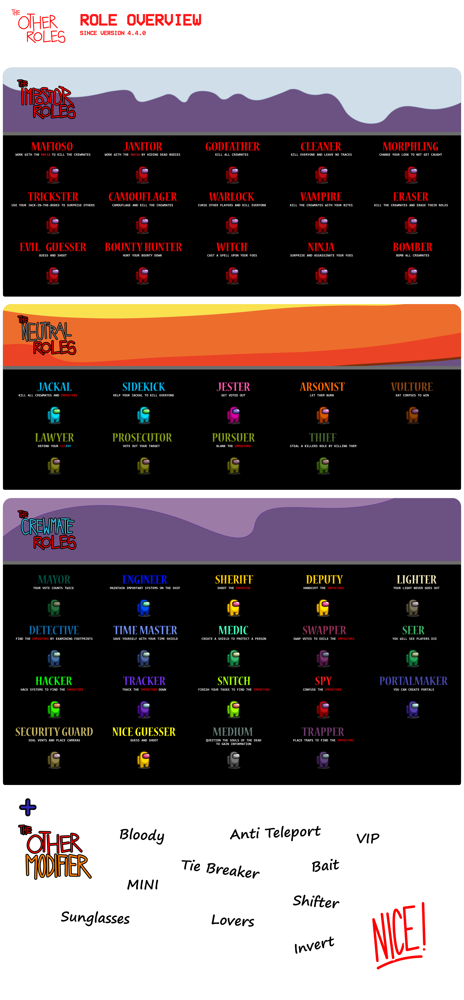
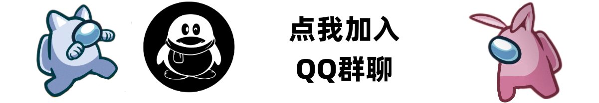

# 本家模组:[The Other Roles](https://github.com/TheOtherRolesAU/TheOtherRoles)

# 分支模组:[The Other Roles Edited](https://github.com/ksduye/The-Other-Roles-Edited)

  
点我查看TheOtherRolesEdited开发者

- 本模组由TheOtherRoles v4.5.1版本进行分支十分感谢一些贡献者对我们的帮助！
- 汉化由[毒液](https://github.com/ksduye) & [方块er](https://github.com/farthest001) 
- 美术编辑:[毒液](https://github.com/ksduye)
- TORE作者:[毒液](https://github.com/ksduye)& [方块er](https://github.com/farthest001) & [Yu](https://github.com/Night-GUA)
- 贡献者:[lezaiya](https://github.com/LezaiYa) & [imp11](https://github.com/dabao40) & [水木年华]()

此模组不隶属于 Among Us 或 Innersloth LLC，其包含的内容也未得到 Innersloth LLC 的认可或以其他方式赞助。此处包含的部分材料是 Innersloth LLC 的财产 ©Innersloth LLC.

  致其他模组开发者:对于使用我们的代码，请阅读并遵守 <a href="#license">许可证</a>

# The Other Roles Edited
**The Other Roles Edited** 是一个为 [Among Us](https://store.steampowered.com/app/945360/Among_Us) 添加许多新职业的MOD, **The Other Roles Edited** 为  [Among Us](https://store.steampowered.com/app/945360/Among_Us) 添加了新 [Settings](#settings) 和新 [Custom Hats](#custom-hats) .

| 内鬼 | 船员 | 中立 | 附加 | 游戏模式 |
|----------|-------------|-----------------|----------------|----------------|
| [黑手党 (黑手党)](#黑手党) | [市长](#市长) | [小丑](#小丑) | [溅血者](#溅血者) | [经典模式](#职业) |
| [小弟 (黑手党)](#黑手党) | [工程师](#工程师) | [纵火犯](#纵火犯) | [厄运儿](#厄运儿) | [赌怪模式](#赌怪模式) |
| [清理者 (黑手党)](#黑手党) | [警长](#警长) | [豺狼](#豺狼) | [破平者](#破平者) | [捉迷藏模式](#捉迷藏模式) |
| [化形者](#化形者) | [捕快](#捕快) | [跟班](#跟班) | [诱饵](#诱饵) | [原版躲猫猫模式](https://www.innersloth.com/new-game-mode-捉迷藏模式-is-here-emergency-meeting-35/) |
| [隐蔽者](#隐蔽者) | [执灯人](#执灯人) | [秃鹫](#秃鹫) | [恋人](#恋人s) | [变形躲猫猫模式](#变形躲猫猫模式)|
| [吸血鬼](#吸血鬼) | [侦探](#侦探) | [律师](#律师) | [太阳镜](#太阳镜) |
| [抹除者](#抹除者) | [时间之主](#时间之主) | [起诉人](#prosecutor) | [迷你船员](#迷你船员) |
| [骗术师](#骗术师) | [医生](#医生) | [起诉人](#起诉人) | [VIP](#vip) |
| [清理者](#清理者) | [换票师](#换票师) | [窃贼](#窃贼) | [酒鬼](#酒鬼) |
| [术士](#术士) | [灵媒](#灵媒) |  | [变色龙](#变色龙) |
| [赏金猎人](#赏金猎人) | [黑客](#黑客) |  | [交换师](#交换师)
| [女巫](#女巫) | [追踪者](#追踪者) |  |  |
| [忍者](#忍者) | [告密者](#告密者) |  |  |
| [爆炸狂](#爆炸狂) | [卧底](#卧底) |  |  |
| [邪恶的赌怪](#赌怪) | [传送师](#传送师) |  |  |
|  | [保安](#保安) |  |  |
|  | [医生](#医生) |  |  |
|  | [猎人](#猎人) |  |  |
|  | [正义的赌怪](#赌怪) |  |  |

[关于模组](#关于模组) 

# 下载
| Among Us - 版本| 模组版本 | 链接 |
|----------|-------------|-----------------|
| 2024.6.4s| v1.0.6| [下载](https://github.com/ksduye/The-Other-Roles-Edited/releases/v1.0.6)
| 2024.3.28s| v1.0.4| [下载](https://github.com/ksduye/The-Other-Roles-Edited/releases/v1.0.4)
| 2023.11.28s| v1.0.3| [下载](https://github.com/ksduye/The-Other-Roles-Edited/releases/v1.0.3)

  
点我查看旧版本

  
| Among Us - 版本| 模组版本 | 链接 |
|----------|-------------|-----------------|
| 2023.11.28s| v1.0.2| [下载](https://github.com/ksduye/The-Other-Roles-Edited/releases/v1.0.2)
| 2023.11.28s| v1.0.1| [下载](https://github.com/ksduye/The-Other-Roles-Edited/releases/v1.0.1.1)
| 2023.11.28s| v1.0.0| [下载](https://github.com/ksduye/The-Other-Roles-Edited/releases/v1.0.1)
| 2023.11.28s| v4.5.1| [下载](https://github.com/TheOtherRolesAU/TheOtherRoles/releases/download/v4.5.1/TheOtherRoles.zip)
| 2023.11.28s| v4.5.0| [下载](https://github.com/TheOtherRolesAU/TheOtherRoles/releases/download/v4.5.0/TheOtherRoles.zip)
| 2023.07.12s| v4.4.2| [下载](https://github.com/TheOtherRolesAU/TheOtherRoles/releases/download/v4.4.2/TheOtherRoles.zip)
| 2023.07.12s| v4.4.1| [下载](https://github.com/TheOtherRolesAU/TheOtherRoles/releases/download/v4.4.1/TheOtherRoles.zip)
| 2023.07.12s| v4.4.0| [下载](https://github.com/TheOtherRolesAU/TheOtherRoles/releases/download/v4.4.0/TheOtherRoles.zip)
| 2023.07.12s| v4.3.4| [下载](https://github.com/Eisbison/TheOtherRoles/releases/download/v4.3.4/TheOtherRoles.zip)
| 2023.07.12s| v4.3.3| [下载](https://github.com/Eisbison/TheOtherRoles/releases/download/v4.3.3/TheOtherRoles.zip)
| 2023.03.28s| v4.3.2| [下载](https://github.com/Eisbison/TheOtherRoles/releases/download/v4.3.2/TheOtherRoles.zip)
| 2023.03.28s| v4.3.1| [下载](https://github.com/Eisbison/TheOtherRoles/releases/download/v4.3.1/TheOtherRoles.zip)
| 2023.02.28s| v4.3.0| [下载](https://github.com/Eisbison/TheOtherRoles/releases/download/v4.3.0/TheOtherRoles.zip)
| 2022.12.14s| v4.2.1| [下载](https://github.com/Eisbison/TheOtherRoles/releases/download/v4.2.1/TheOtherRoles.zip)
| 2022.10.25s| v4.2.0| [下载](https://github.com/Eisbison/TheOtherRoles/releases/download/v4.2.0/TheOtherRoles.zip)
| 2022.9.20s| v4.1.7| [下载](https://github.com/Eisbison/TheOtherRoles/releases/download/v4.1.7/TheOtherRoles.zip)
| 2022.6.21s| v4.1.6| [下载](https://github.com/Eisbison/TheOtherRoles/releases/download/v4.1.6/TheOtherRoles.zip)
| 2022.6.21s| v4.1.5| [下载](https://github.com/Eisbison/TheOtherRoles/releases/download/v4.1.5/TheOtherRoles.zip)
| 2022.3.29s| v4.1.4| [下载](https://github.com/Eisbison/TheOtherRoles/releases/download/v4.1.4/TheOtherRoles.zip)
| 2022.3.29s| v4.1.3| [下载](https://github.com/Eisbison/TheOtherRoles/releases/download/v4.1.3/TheOtherRoles.zip)
| 2022.3.29s| v4.1.2| [下载](https://github.com/Eisbison/TheOtherRoles/releases/download/v4.1.2/TheOtherRoles.zip)
| 2022.3.29s| v4.1.1| [下载](https://github.com/Eisbison/TheOtherRoles/releases/download/v4.1.1/TheOtherRoles.zip)
| 2022.3.29s| v4.1.0| [下载](https://github.com/Eisbison/TheOtherRoles/releases/download/v4.1.0/TheOtherRoles.zip)
| 2022.3.29s| v4.0.0| [下载](https://github.com/Eisbison/TheOtherRoles/releases/download/v4.0.0/TheOtherRoles.zip)
| 2022.3.29s| v3.4.5| [下载](https://github.com/Eisbison/TheOtherRoles/releases/download/v3.4.5/TheOtherRoles.zip)
| 2022.2.23s| v3.4.4| [下载](https://github.com/Eisbison/TheOtherRoles/releases/download/v3.4.4/TheOtherRoles.zip)
| 2021.12.15s| v3.4.3| [下载](https://github.com/Eisbison/TheOtherRoles/releases/download/v3.4.3/TheOtherRoles.zip)
| 2021.12.15s| v3.4.2| [下载](https://github.com/Eisbison/TheOtherRoles/releases/download/v3.4.2/TheOtherRoles.zip)
| 2021.12.15s| v3.4.1| [下载](https://github.com/Eisbison/TheOtherRoles/releases/download/v3.4.1/TheOtherRoles.zip)
| 2021.12.15s| v3.4.0| [下载](https://github.com/Eisbison/TheOtherRoles/releases/download/v3.4.0/TheOtherRoles.zip)
| 2021.12.15s| v3.3.3| [下载](https://github.com/Eisbison/TheOtherRoles/releases/download/v3.3.3/TheOtherRoles.zip)
| 2021.12.15s| v3.3.2| [下载](https://github.com/Eisbison/TheOtherRoles/releases/download/v3.3.2/TheOtherRoles.zip)
| 2021.12.14s| v3.3.1| [下载](https://github.com/Eisbison/TheOtherRoles/releases/Download/v3.3.1/TheOtherRoles.zip)
| 2021.12.14s| v3.3.0| [下载](https://github.com/Eisbison/TheOtherRoles/releases/Download/v3.3.0/TheOtherRoles.zip)
| 2021.11.9.5s| v3.2.4| [下载](https://github.com/Eisbison/TheOtherRoles/releases/Download/v3.2.4/TheOtherRoles.zip)
| 2021.11.9.5s| v3.2.3| [下载](https://github.com/Eisbison/TheOtherRoles/releases/download/v3.2.3/TheOtherRoles.zip)
| 2021.11.9.5s| v3.2.2| [下载](https://github.com/Eisbison/TheOtherRoles/releases/download/v3.2.2/TheOtherRoles.zip)
| 2021.11.9.5s| v3.2.1| [下载](https://github.com/Eisbison/TheOtherRoles/releases/download/v3.2.1/TheOtherRoles.zip)
| 2021.11.9.5s| v3.2.0| [下载](https://github.com/Eisbison/TheOtherRoles/releases/download/v3.2.0/TheOtherRoles.zip)
| 2021.11.9.5s| v3.1.2| [下载](https://github.com/Eisbison/TheOtherRoles/releases/download/v3.1.2/TheOtherRoles.zip)
| 2021.11.9.5s| v3.1.1| [下载](https://github.com/Eisbison/TheOtherRoles/releases/download/v3.1.1/TheOtherRoles.zip)
| 2021.11.9.5s| v3.1.0| [下载](https://github.com/Eisbison/TheOtherRoles/releases/download/v3.1.0/TheOtherRoles.zip)
| 2021.11.9.5s| v3.0.0| [下载](https://github.com/Eisbison/TheOtherRoles/releases/download/v3.0.0/TheOtherRoles.zip)
| 2021.6.30s| v2.9.2| [下载](https://github.com/Eisbison/TheOtherRoles/releases/download/v2.9.2/TheOtherRoles.zip)
| 2021.6.30s| v2.9.1| [下载](https://github.com/Eisbison/TheOtherRoles/releases/download/v2.9.1/TheOtherRoles.zip)
| 2021.6.30s| v2.9.0| [下载](https://github.com/Eisbison/TheOtherRoles/releases/download/v2.9.0/TheOtherRoles.zip)
| 2021.6.30s| v2.8.1| [下载](https://github.com/Eisbison/TheOtherRoles/releases/download/v2.8.1/TheOtherRoles.zip)
| 2021.6.30s| v2.8.0| [下载](https://github.com/Eisbison/TheOtherRoles/releases/download/v2.8.0/TheOtherRoles.zip)
| 2021.6.30s| v2.7.3| [下载](https://github.com/Eisbison/TheOtherRoles/releases/download/v2.7.3/TheOtherRoles.zip)
| 2021.6.15s| v2.7.1| [下载](https://github.com/Eisbison/TheOtherRoles/releases/download/v2.7.1/TheOtherRoles.zip)
| 2021.6.15s| v2.7.0| [下载](https://github.com/Eisbison/TheOtherRoles/releases/download/v2.7.0/TheOtherRoles.zip)
| 2021.5.25.2s| v2.6.7| [下载](https://github.com/Eisbison/TheOtherRoles/releases/download/v2.6.7/TheOtherRoles.zip)
| 2021.5.10s| v2.6.6| [下载](https://github.com/Eisbison/TheOtherRoles/releases/download/v2.6.6/TheOtherRoles.zip)
| 2021.5.10s| v2.6.5| [下载](https://github.com/Eisbison/TheOtherRoles/releases/download/v2.6.5/TheOtherRoles.zip)
| 2021.5.10s| v2.6.4| [下载](https://github.com/Eisbison/TheOtherRoles/releases/download/v2.6.4/TheOtherRoles.zip)
| 2021.5.10s| v2.6.3| [下载](https://github.com/Eisbison/TheOtherRoles/releases/download/v2.6.3/TheOtherRoles.zip)
| 2021.5.10s| v2.6.2| [下载](https://github.com/Eisbison/TheOtherRoles/releases/download/v2.6.2/TheOtherRoles.zip)
| 2021.4.14s| v2.6.1| [下载](https://github.com/Eisbison/TheOtherRoles/releases/download/v2.6.1/TheOtherRoles.zip)
| 2021.4.14s| v2.6.0| [下载](https://github.com/Eisbison/TheOtherRoles/releases/download/v2.6.0/TheOtherRoles.zip)
| 2021.4.14s| v2.5.1| [下载](https://github.com/Eisbison/TheOtherRoles/releases/download/v2.5.1/TheOtherRoles.zip)
| 2021.4.14s| v2.5.0| [下载](https://github.com/Eisbison/TheOtherRoles/releases/download/v2.5.0/TheOtherRoles.zip)
| 2021.4.14s| v2.4.0| [下载](https://github.com/Eisbison/TheOtherRoles/releases/download/v2.4.0/TheOtherRoles.zip)
| 2021.4.14s| v2.3.0| [下载](https://github.com/Eisbison/TheOtherRoles/releases/download/v2.3.0/TheOtherRoles.zip)
| 2021.4.14s| v2.2.2| [下载](https://github.com/Eisbison/TheOtherRoles/releases/download/v2.2.2/TheOtherRoles.zip)
| 2021.4.12s| v2.2.1| [下载](https://github.com/Eisbison/TheOtherRoles/releases/download/v2.2.1/TheOtherRoles.zip)
| 2021.4.12s| v2.2.0| [下载](https://github.com/Eisbison/TheOtherRoles/releases/download/v2.2.0/TheOtherRoles.zip)
| 2021.3.31.3s| v2.1.0| [下载](https://github.com/Eisbison/TheOtherRoles/releases/download/v2.1.0/TheOtherRoles.zip)
| 2021.3.31.3s| v2.0.1 beta| [下载](https://github.com/Eisbison/TheOtherRoles/releases/download/v2.0.1/TheOtherRoles.zip)
| 2021.3.31.3s | v2.0.0 beta | [下载](https://github.com/Eisbison/TheOtherRoles/releases/download/v2.0.0/TheOtherRoles.zip)
| 2021.3.5s | v1.8.2 | [下载](https://github.com/Eisbison/TheOtherRoles/releases/download/v1.8.2/TheOtherRoles.zip)
| 2021.3.5s | v1.8.1 | [下载](https://github.com/Eisbison/TheOtherRoles/releases/download/v1.8.1/TheOtherRoles.zip)
| 2021.3.5s | v1.8 | [下载](https://github.com/Eisbison/TheOtherRoles/releases/download/v1.8/TheOtherRoles.zip)
| 2021.3.5s | v1.7 | [下载](https://github.com/Eisbison/TheOtherRoles/releases/download/v1.7/TheOtherRoles.zip)
| 2021.3.5s | v1.6 | [下载](https://github.com/Eisbison/TheOtherRoles/releases/download/v1.6/TheOtherRoles.zip)
| 2021.3.5s | v1.5 | [下载](https://github.com/Eisbison/TheOtherRoles/releases/download/v1.5/TheOtherRoles.zip)
| 2021.3.5s | v1.4 | [下载](https://github.com/Eisbison/TheOtherRoles/releases/download/v1.4/TheOtherRoles.zip)
| 2021.3.5s | v1.3 | [下载](https://github.com/Eisbison/TheOtherRoles/releases/download/v1.3/TheOtherRoles.zip)
| 2020.12.19s | v1.1 | [下载](https://github.com/Eisbison/TheOtherRoles/releases/download/v1.1/TheOtherRoles.zip)
| 2020.12.19s | v1.0 | [下载](https://github.com/Eisbison/TheOtherRoles/files/6097191/TheOtherRoles.zip)

# 设置

该模组为《Among Us》添加了一些新设置（除了角色设置）：
- **船员人数：船员角色的数量可以在大厅内设置。**
- **队友角色（忽略最小值/最大值）：每个人都会得到一个角色，即使设置说会有普通的船员（需要足够多的角色超过 0%）。**
- **中立数量：中立角色的数量可以在大厅内设置。**
- **内鬼数量：可以在大厅内设置冒名顶替者角色的数量。**
- **附加职业数量：修改器的数量可以在大厅内设置。**
- **地图：地图可以在大厅内更改。**
- **最大会议次数：您可以设置总共可以调用的最大会议数（每个玩家仍然有个人最大按钮数，但如果达到最大会议数，即使您还剩下一些会议，也无法使用您的会议。冒名顶替者和豺狼会议也算在内）。**
- **允许跳过紧急会议：如果设置为 false，则紧急会议中不会有跳过按钮。如果玩家不投票，他们会自己投票。**
- **隐藏玩家姓名：隐藏所有玩家的姓名，这些玩家的角色不为你所不知道。团队恋人/冒名顶替者/豺狼仍然可以看到他们队友的名字。冒名顶替者也可以看到间谍的名字，大家还能看到迷你的年龄。**
- **允许并行 MedBay 扫描：允许玩家同时执行他们的 MedBay 扫描。**
- **盾牌上一轮第一个被击杀的玩家将被屏蔽，直到第一次见面之前所有可见的玩家。**
- ****在闹鬼或缩小之前完成任务** 缩小功能以及闹鬼将对玩家隐藏，直到他们完成所有任务**
- **管理表显示尸体**
- **如果灯熄灭，摄像头切换到夜视当灯熄灭时，相机上看不到任何颜色和化妆品。迷你可以斑点！**
- **冒名顶替者视觉忽略夜视摄像头**
- **在随机地图上玩如果启用，它允许您为每个当前映射设置百分比，但 ehT dlekS 除外。**
- **鬼魂可以看到角色。**
- **鬼魂可以看到选票。**
- **幽灵还可以看到修饰符。**
- **幽灵查看任务和其他信息其他信息：诸如谁被诅咒，被铐住等，还有医疗盾牌，闪光灯，工程师修复等。**
- **该地图可在会议期间访问，并在报告尸体/召集会议时显示您的最后位置。**
- **当你是一个幽灵并完成任务时，你会得到一个缩小/概览功能。**
- **任务计数：您现在可以选择更多任务。**
- **角色摘要：当游戏结束时，将有一个列表，包括所有玩家、他们的角色、他们的任务进度以及杀手杀死了多少玩家。**
- **深色/浅色：显示会议中每个玩家的颜色类型。**
- **在游戏中显示设置您可以使用地图按钮下方的按钮或 F1 键打开或关闭大厅设置的显示**

| 地图 | 常见任务 | 短任务 | 长任务 |
|----------|:-------------:|:-------------:|:-------------:|
| 骷髅舰 | 2 | 19 | 8
| 米拉HQ | 2 | 13 | 11
| 波鲁斯 | 4 | 14 | 15
| 高空飞艇 | 2 | 23 | 15
| 真菌世界 | 2 | 114514 | 208200
-----------------------

# 自定义帽子
## 创建并提交新的帽子设计
- 详情请去[TheOtherRoles](https://github.com/TheOtherRolesAU/TheOtherRoles)

# 颜色
- TOR颜色详情请去[TheOtherRoles](https://github.com/TheOtherRolesAU/TheOtherRoles)
- TORE颜色：
- `TORE模组颜色`
  - 珊瑚色
  - 朝霞色
  - 纯黑色
  - 桃花粉
  - 青色
  - 紫红色
  - 热粉色
  - 薰衣草色
  - 蓝紫色
  - 深蓝色
  - 深橙色
  - 纯白色
  - 海水色
  - 冰激凌色
  - 浅米色
  - 生机绿
  - 皇家绿色
  - 芥末绿
  - 柠檬色
  - 荧光色
  - 天蓝色
  - 粉&蓝(白色)
  - 焦糖色
  - 清新绿
  
# 职业

## 黑手党
### **阵营:内鬼**
The 黑手党 are a group of three Impostors.\
The Godfather works like a normal Impostor.\
The Mafioso is an Impostor who cannot kill until the Godfather is dead.\
The Janitor is an Impostor who cannot kill, but they can hide dead bodies instead.\
\
**便签:**
- There have to be 3 Impostors activated for the 黑手党 to spawn.

### 游戏设置
| 名字 | 描述 |
|----------|:-------------:|
| 黑手党 Spawn Chance | -
| Janitor Cooldown | -
-----------------------

## 化形者
### **阵营:内鬼**
The 化形者 is an Impostor which can additionally scan the appearance of a player. After an arbitrary time they can take on that appearance for 10s.\
\
**便签:**
- They shrink to the size of the 迷你船员 when they copy its look.
- The 黑客 sees the new color on the admin table.
- The color of the footprints changes accordingly (also the ones that were already on the ground).
- The other Impostor still sees that they are an Impostor (the 名字 remains red).
- The shield indicator changes accordingly (the 化形者 gains or loses the shield indicator).
- 追踪者 arrows keep working.

### 游戏设置
| 名字 | 描述 |
|----------|:-------------:|
| 化形者 Spawn Chance | -
| 化形者 Cooldown | -
| Morph Duration | Time the 化形者 stays morphed
-----------------------

## 隐蔽者
### **阵营:内鬼**
The 隐蔽者 is an Impostor which can additionally activate a camouflage mode.\
The camouflage mode lasts for 10s and while it is active, all player 名字s/pets/hats\
are hidden and all players have the same color.\
\
**便签:**
- The 迷你船员 will look like all the other players
- The color of the footprints turns gray (also the ones that were already on the ground).
- The 黑客 sees gray icons on the admin table
- The shield is not visible anymore
- 追踪者 arrows keep working

### 游戏设置
| 名字 | 描述 |
|----------|:-------------:|
| 隐蔽者 Spawn Chance | -
| 隐蔽者 Cooldown | -
| Camo Duration | Time players stay camouflaged
-----------------------

## 吸血鬼
### **阵营:内鬼**
The 吸血鬼 is an Impostor, that can bite other player. Bitten players die after a configurable amount of time.\
If the 吸血鬼 spawn chance is greater 0 (even if there is no 吸血鬼 in the game), all players can place one garlic.\
If a victim is near a garlic, the "Bite Button" turns into the default "Kill Button" and the 吸血鬼 can only perform a normal kill.\
\
**便签:**
- If a bitten player is still alive when a meeting is being called, they die at the start of the meeting.
- The cooldown is the same as the default kill cooldown (+ the kill delay if the 吸血鬼 bites the target).
- If there is a 吸血鬼 in the game, there can't be a 术士.
- If the 吸血鬼 bites a player and the 窃贼 kills the 吸血鬼, the bite will still be performed, but the new 吸血鬼 will be displayed in the kill animation.
- If the 吸血鬼 bites a player and gets killed before the bite is performed, the biten player will survive.

### 游戏设置
| 名字 | 描述 |
|----------|:-------------:|
| 吸血鬼 Spawn Chance | -
| 吸血鬼 Kill Delay | -
| 吸血鬼 Cooldown | Sets the kill/bite cooldown
| 吸血鬼 Can Kill Near Garlics | The 吸血鬼 can never bite when their victim is near a garlic. If this option is set to true, they can still perform a normal kill there.
-----------------------

## 抹除者
### **阵营:内鬼**
The 抹除者 is an Impostor that can erase the role of every player.\
The targeted players will lose their role after the meeting right before a player is exiled.\
After every erase, the cooldown increases by 10 seconds.\
The erase will be performed, even if the 抹除者 or their target die before the next meeting.\
By default the 抹除者 can erase everyone but the 卧底 and other Impostors.\
Depending on the options they can also erase them (Impostors will lose their special Impostor ability).\
\
**便签:**
- The 交换师 shift will always be triggered before the Erase (hence either the new role of the 交换师 will be erased or the 交换师 saves the role of their target, depending on whom the 抹除者 erased).
- As the erase is being triggered before the ejection of a player, a 小丑 win would not happen, as the erase will be triggered before.
- 附加职业 will not be erased.

### 游戏设置
| 名字 | 描述 |
|----------|:-------------:|
| 抹除者 Spawn Chance | -
| 抹除者 Cooldown | The 抹除者's cooldown will increase by 10 seconds after every erase.
| 抹除者 Can Erase Anyone | If set to false, they can't erase the 卧底 and other Impostors
-----------------------

## 骗术师
### **阵营:内鬼**
The 骗术师 is an Impostor that can place 3 jack-in-the-boxes that are invisible at first to other players.\
If the 骗术师 has placed all of their boxes they will be converted into a vent network usable only by the 骗术师 themself, but the boxes are revealed to the others.\
If the boxes are converted to a vent network, the 骗术师 gains a new ability "Lights out" to limit the visibility of Non-Impostors, that cannot be fixed by other players. Lights are automatically restored after a while.\
\
**便签:**
- Impostors will get a text indicator at the bottom of the screen to notify them if the lights are out due to the 骗术师 ability, as there is no sabotage arrows or task to sabotage text to otherwise notify them about it.

### 游戏设置
| 名字 | 描述 |
|----------|:-------------:|
| 骗术师 Spawn Chance | -
| 骗术师 Box Cooldown | Cooldown for placing jack-in-the-boxes
| 骗术师 Lights Out Cooldown | Cooldown for their "lights out" ability
| 骗术师 Lights Out Duration | Duration after which the light is automatically restored
-----------------------

## 清理者
### **阵营:内鬼**
The 清理者 is an Impostor who has the ability to clean up dead bodies.\
\
**便签:**
- The Kill and Clean cooldown are shared, preventing them from immediately cleaning their own kills.
- If there is a 清理者 in the game, there can't be a 秃鹫.

### 游戏设置
| 名字 | 描述 |
|----------|:-------------:|
| 清理者 Spawn Chance | -
| 清理者 Cooldown | Cooldown for cleaning dead bodies
-----------------------

## 术士
### **阵营:内鬼**
The 术士 is an Impostor, that can curse another player (the cursed player doesn't get notified).\
If the cursed person stands next to another player, the 术士 is able to kill that player (no matter how far away they are).\
Performing a kill with the help of a cursed player, will lift the curse and it will result in the 术士 being unable to move for a configurable amount of time.\
The 术士 can still perform normal kills, but the two buttons share the same cooldown.\
\
**便签:**
- The 术士 can always kill their Impostor mates (and even themself) using the "cursed kill"
- If there is a 术士 in the game, there can't be a 吸血鬼
- Performing a normal kill, doesn't lift the curse

### 游戏设置
| 名字 | 描述 |
|----------|:-------------:|
| 术士 Spawn Chance | -
| 术士 Cooldown | Cooldown for using the Curse and curse Kill
| 术士 Root Time | Time the 术士 is rooted in place after killing using the curse
-----------------------

## Bounty Hunter
### **阵营:内鬼**
The Bounty Hunter is an Impostor, that continuously get bounties (the targeted player doesn't get notified).\
The target of the Bounty Hunter swaps after every meeting and after a configurable amount of time.\
If the Bounty Hunter kills their target, their kill cooldown will be a lot less than usual.\
Killing a player that's not their current target results in an increased kill cooldown.\
Depending on the options, there'll be an arrow pointing towards the current target.\
\
**便签:**
- The target won't be an Impostor, a 卧底 or the Bounty Hunter's 恋人.
- Killing the target resets the timer and a new target will be selected.

### 游戏设置
| 名字 | 描述 |
|----------|:-------------:|
| Bounty Hunter Spawn Chance | -
| Duration After Which Bounty Changes | -
| Cooldown After Killing Bounty | -
| Additional Cooldown After Killing Others | Time will be added to the normal impostor cooldown if the Bounty Hunter kills a not-bounty player
| Show Arrow Pointing Towards The Bounty | If set to true an arrow will appear (only visiable for the Bounty Hunter)
| Bounty Hunter Arrow Update Interval | Sets how often the position is being updated
-----------------------

## 女巫
### **阵营:内鬼**
The 女巫 is an Impostor who has the ability to cast a spell on other players.\
During the next meeting, the spellbound player will be highlighted and they'll die right after the meeting.\
There are multiple options listed down below with which you can configure to fit your taste.\
Similar to the 吸血鬼, shields and blanks will be checked twice (at the end of casting the spell on the player and at the end of the meeting, when the spell will be activated).\
This can result in players being marked as spelled during the meeting, but not dying in the end (when they get a shield or the 女巫 gets blanked after they were spelled by the 女巫).\
If the 女巫 dies before the meeting starts or if the 女巫 is being guessed during the meeting, the spellbound players will be highlighted but they'll survive in any case.\
Depending on the options you can choose whether voting the 女巫 out will save all the spellbound players or not.\
\
**便签:**
- The spellbound players will die before the voted player dies (which might trigger e.g. trigger an Impostor win condition, even if the 女巫 is the one being voted)

### 游戏设置
| 名字 | 描述 |
|----------|:-------------:|
| 女巫 Spawn Chance | -
| 女巫 Spell Casting Cooldown | -
| 女巫 Additional Cooldown | The spell casting cooldown will be increased by the amount you set here after each spell
| 女巫 Can Spell Everyone | If set to false, the 女巫 can't spell the 卧底 and other Impostors
| 女巫 Spell Casting Duration | The time that you need to stay next to the target in order to cast a spell on it
| Trigger Both Cooldowns | If set to true, casting a spell will also trigger cooldown of the kill button and vice versa (but the two cooldowns may vary)
| Voting The 女巫 Saves All The Targets | If set to true, all the cursed targets will survive at the end of the meeting
-----------------------

## 忍者
### **阵营:内鬼**
The 忍者 is an Impostor who has the ability to kill another player all over the map.\
You can mark a player with your ability and by using the ability again, you jump to the position of the marked player and kill it.\
Depending on the options you know where your marked player is.\
If the 忍者 uses its ability, it will leave a trace (leaves) for a configurable amount of time where it activated the ability and additionally where it killed the before marked player.\
When performing a 忍者 ability kill, the 忍者 can be invisible for some seconds (depends on options)\
\
**便签:**
- The 忍者 has a 5 second cooldown after marking a player
- The trace has a darker (black) or 执灯人 (white) color depending on the players color that will fade into green
- The mark on the marked player will reset after a meeting or after using the ability to kill the marked player. Performing a normal kill will **NOT** reset the mark
- If the 忍者 tries to kill a shielded player (e.g. 医生 shield, Shield last game first kill ), the kill will not be performed
- If the 忍者 tries to kill the Time Master while the shield is active, the 忍者 won't teleport to the players position, but the Time Master shield will still be activated
- If the marked target is on a different floor on Submerged, the arrow will always point to the elevator

### 游戏设置
| 名字 | 描述 |
|----------|:-------------:|
| 忍者 Spawn Chance | -
| 忍者 Mark Cooldown | -
| 忍者 Knows Location Of Target | -
| Trace Duration | -
| Time Till Trace Color Has Faded | -
| Time The 忍者 Is Invisible | -
-----------------------

## 爆炸狂
### **阵营:内鬼**
The 爆炸狂 is an Impostor who has the ability to be very explosive. They have the ability to plant bombs to spread grouping Crewmates and also kill them.\
The 爆炸狂 also has the ability to perform a normal kill like all Impostors.\
The plant time of the bomb can be different to the kill cooldown depending on the settings.\
Crewmates can defuse a bomb depending on the settings.

**便签:**
- The bomb won't kill a shielded player (医生, First Kill Shield)
- The bomb won't kill a 迷你船员 until it's grown up
- The bomb can kill the 爆炸狂 as well as their teammate(s)
- The hearing range can be higher/lower than the actual destruction range, depending on the settings, and has a visual indicator
- The visual indicator slowly fades into red until the bomb explodes and it does not show the explosion range (only hearing range)!
- The bomb can be defused by standing on it and snipping the fuse (button)

### 游戏设置
| 名字 | 描述 |
|----------|:-------------:|
| 爆炸狂 Spawn Chance | -
| Bomb Destruction Time | -
| Bomb Destruction Range | -
| Bomb Hear Range | -
| Bomb Defuse Duration | -
| Bomb Cooldown | -
| Bomb Is Active After |
-----------------------

## 赌怪
### **阵营: 船员或内鬼**
The 赌怪 can be a Crewmate or an Impostor (depending on the settings).\
The 赌怪 can shoot players during the meeting, by guessing its role. If the guess is wrong, the 赌怪 dies instead.\
You can select how many players can be shot per game and if multiple players can be shot during a single meeting.\
The guesses Impostor and Crewmate are only right, if the player is part of the corresponding team and has no special role.\
You can only shoot during the voting time.\
Depending on the options, the 赌怪 can't guess the shielded player and depending on the 医生 options the 医生/shielded player might be notified (no one will die, independently of what the 赌怪 guessed).\
\
**便签:**
- If a player gets shot, you'll get back your votes
- 小丑 wins won't be triggered, if the 赌怪 shoots the 小丑 before the 小丑 gets voted out

### 游戏设置
| 名字 | 描述 |
|----------|:-------------:|
| 赌怪 Spawn Chance | -
| Chance That The 赌怪 Is An Impostor | -
| 赌怪 Number Of Shots Per Game | -
| 赌怪 Can Shoot Multiple Times Per Meeting |  -
| Guesses Visible In Ghost Chat | -
| Guesses Ignore The 医生 Shield | -
| Evil 赌怪 Can Guess The 卧底 | -
| Both 赌怪 Spawn Rate | -
| 赌怪 Can't Guess 告密者 When Tasks Completed | -

-----------------------

## 小丑
### **阵营:中立**
The 小丑 does not have any tasks. They win the game as a solo, if they get voted out during a meeting.

### 游戏设置
| 名字 | 描述 |
|----------|:-------------:|
| 小丑 Spawn Chance | -
| 小丑 Can Call Emergency Meeting | Option to disable the emergency button for the 小丑
-----------------------

## 纵火犯
### **阵营:中立**
The 纵火犯 does not have any tasks, they have to win the game as a solo.\
The 纵火犯 can douse other players by pressing the douse button and remaining next to the player for a few seconds.\
If the player that the 纵火犯 douses walks out of range, the cooldown will reset to 0.\
After dousing everyone alive the 纵火犯 can ignite all the players which results in an 纵火犯 win.

### 游戏设置
| 名字 | 描述 |
|----------|:-------------:|
| 纵火犯 Spawn Chance | -
| 纵火犯 Countdown | -
| 纵火犯 Douse Duration | The time it takes to douse a player
-----------------------

## 豺狼
### **阵营:豺狼**
The 豺狼 is part of an extra team, that tries to eliminate all the other players.\
The 豺狼 has no tasks and can kill Impostors, Crewmates and Neutrals.\
The 豺狼 (if allowed by the options) can select another player to be their 跟班.
Creating a 跟班 removes all tasks of the 跟班 and adds them to the team 豺狼. The 跟班 loses their current role (except if they're a 恋人, then they play in two teams).
The "Create 跟班 Action" may only be used once per 豺狼 or once per game (depending on the options).
The 豺狼 can also promote Impostors to be their 跟班, but depending on the options the Impostor will either really turn into the 跟班 and leave the team Impostors or they will just look like the 跟班 to the 豺狼 and remain as they were.\
Also if a 卧底 or Impostor gets 跟班ed, they still will appear red to the Impostors.

The team 豺狼 enables multiple new outcomes of the game, listing some examples here:
- The Impostors could be eliminated and then the crew plays against the team 豺狼.
- The Crew could be eliminated, then the Team 豺狼 fight against the Impostors (The Crew can still make a task win in this scenario)

The priority of the win conditions is the following:
1. Crewmate 迷你船员 lose by vote
2. 纵火犯 wins by vote
3. 纵火犯 win
4. Team Impostor wins by sabotage
5. Team Crew wins by tasks (also possible if the whole Crew is dead)
6. 恋人s among the last three players win
7. Team 豺狼 wins by outnumbering (When the team 豺狼 contains an equal or greater amount of players than the Crew and there are 0 Impostors left and team 豺狼 contains no 恋人)
8. Team Impostor wins by outnumbering (When the team Impostors contains an equal or greater amount of players than the Crew and there are 0 players of the team 豺狼 left and team Impostors contains no 恋人)
9. Team Crew wins by outnumbering (When there is no player of the team 豺狼 and the team Impostors left)

**便签:**
- The 豺狼 (and their 跟班) may be killed by a 警长.
- A 豺狼 cannot target the 迷你船员, while it's growing up. After that they can kill it or select it as its 跟班.
- The Crew can still win, even if all of their members are dead, if they finish their tasks fast enough (That's why converting the last Crewmate with tasks left into a 跟班 results in a task win for the crew.)

If both Impostors and 豺狼s are in the game, the game continues even if all Crewmates are dead. Crewmates may still win in this case by completing their tasks. 豺狼 and Impostor have to kill each other.

### 游戏设置
| 名字 | 描述
|----------|:-------------:|
| 豺狼 Spawn Chance | - |
| 豺狼/跟班 Kill Cooldown | Kill cooldown |
| 豺狼 Create 跟班 Cooldown | Cooldown before a 跟班 can be created |
| 豺狼 can use vents | Yes/No |
| 豺狼 can create a 跟班 | Yes/No |
| 豺狼s promoted from 跟班 can create a 跟班 | Yes/No (to prevent the 豺狼 team from growing) |
| 豺狼s can make an Impostor to their 跟班 | Yes/No (to prevent a 豺狼 from turning an Impostor into a 跟班, if they use the ability on an Impostor they see the Impostor as 跟班, but the Impostor isn't converted to 跟班. If this option is set to "No" 豺狼 and 跟班 can kill each other.) |
| 豺狼 and 跟班 have Impostor vision | - |
-----------------------

## 跟班
### **阵营:豺狼**
Gets assigned to a player during the game by the "Create 跟班 Action" of the 豺狼 and joins the 豺狼 in their quest to eliminate all other players.\
Upon the death of the 豺狼 (depending on the options), they might get promoted to 豺狼 themself and potentially even assign a 跟班 of their own.\
\
**便签:**
- A player that converts into a 跟班 loses their previous role and tasks (if they had one).
- The 跟班 may be killed by a 警长.
- The 跟班 cannot target the 迷你船员, while it's growing up.

### 游戏设置
| 名字 | 描述
|----------|:-------------:|
| 豺狼/跟班 Kill Cooldown | Uses the same kill cooldown setting as the 豺狼 |
| 跟班 gets promoted to 豺狼 on 豺狼 death |  Yes/No |
| 跟班 can kill | Yes/No |
| 跟班 can use vents | Yes/No |
-----------------------

## 秃鹫
### **阵营:中立**
The 秃鹫 does not have any tasks, they have to win the game as a solo.\
The 秃鹫 is a neutral role that must eat a specified number of corpses (depending on the options) in order to win.\
Depending on the options, when a player dies, the 秃鹫 gets an arrow pointing to the corpse.\
If there is a 秃鹫 in the game, there can't be a 清理者.

**便签**
- If the corpse is on a different floor on Submerged, the arrow will always point to the elevator

### 游戏设置
| 名字 | 描述 |
|----------|:-------------:|
| 秃鹫 Spawn Chance | -
| 秃鹫 Countdown | -
| Number Of Corpses Needed To Be Eaten | Corpes needed to be eaten to win the game
| 秃鹫 Can Use Vents | -
| Show Arrows Pointing Towards The Corpes | -
-----------------------

## 律师
### **阵营:中立**
The 律师 is a neutral role that has a client.\
The client might be an Impostor or 豺狼 which is no 恋人.\
Depending on the options, the client can also be a 小丑.\
The 律师 needs their client to win in order to win the game.\
Their client doesn't know that it is their client.\
If their client gets voted out, the 律师 dies with the client.\
If their client dies, the 律师 changes their role and becomes the [起诉人](#起诉人), which has a different goal to win the game.\
\
How the 律师 wins:
- 律师 dead/alive, client alive and client wins: The 律师 wins together with the team of the client.
- If their client is 小丑 and the 小丑 gets voted out, the 律师 wins together with the 小丑.

**便签:**
- If the client disconnects, the 律师 will also turn into the 起诉人.
- The 律师 needs to figure out the role of their client depending on the options.
- The tasks only count, if the 律师 gets promoted to 起诉人.
- If the 律师 dies before their client, they will lose all their tasks and will get the overview immediately.

### 游戏设置
| 名字 | 描述 |
|----------|:-------------:|
| 律师 Spawn Chance | -
| Chance That The 律师 Is Prosecutor | -
| 律师/Prosecutor Vision | 起诉人 has normal vision
| 律师/Prosecutor Knows Target Role | -
| 律师/Prosecutor Can Call Emergency Meeting | -
| 律师 Target Can Be The 小丑 | -
-----------------------

## Prosecutor
### **阵营:中立**
The Prosecutor is a neutral role that resembles the 律师. The Prosecutor has a client who is a Crewmate.\
The Prosecutor needs their client to be voted out in order to win the game.\
The Prosecutor's client doesn't know that they are their client.\
If the client gets 跟班ed, the Prosecutor changes their role and becomes the client's [律师](#律师) and has to protect the
client from now on.\
If the Prosecutor's client dies, the Prosecutor changes their role and becomes the [起诉人](#起诉人), which has a different goal to win the game.

**便签:**
- The Prosecutor's role settings are shared with the 律师 settings.
- If the client disconnects, the Prosecutor will also turn into the 起诉人.
- The Prosecutor needs to figure out the role of their client depending on the options.
- The tasks only count, if the Prosecutor gets promoted to 起诉人.
- If the Prosecutor dies before their client, they will lose all their tasks and will get the overview immediately.

## 起诉人
### **阵营:中立**
The 起诉人 is still a neutral role, but has a different goal to win the game; they have to be alive when the game ends and the Crew wins.\
In order to achieve this goal, the 起诉人 has an ability called "Blank", where they can fill a killer's (this also includes the 警长) weapon with a blank. So, if the killer attempts to kill someone, the killer will miss their target, and their cooldowns will be triggered as usual.\
If the killer fires the "Blank", shields (e.g. 医生 shield or Time Master shield) will not be triggered.\
The 起诉人 has tasks (which can already be done while being a 律师/Prosecutor), that count towards the task win for the Crewmates. If the 起诉人 dies, their tasks won't be counted anymore.

### 游戏设置
| 名字 | 描述 |
|----------|:-------------:|
| 起诉人 Blank Cooldown | -
| 起诉人 Number Of Blanks | -
-----------------------

## 窃贼
### **阵营:中立**
The 窃贼 has to kill another killer (Impostor, 豺狼/跟班 and if enabled 警长)
in order to have a win condition.\
If the 窃贼 doesn't kill another killer they will lose the game.\
If the 窃贼 kills one of the other killers, the 窃贼 overtakes their role (e.g. 忍者) and joins their team (in this case
team Impostor). They then have the new Role's win condition (e.g. Impostor-Win).\
If the 窃贼 tries to kill any non-killing role (Crewmate or Neutral), they die similar to a misfiring 警长.\
\
**便签**
- If the option "窃贼 Can Kill 警长" is On, the 窃贼 has tasks which will ONLY begin to count, if they kill
the 警长. While the 窃贼 hasn't fired, their tasks do not count towards the taskwin.
- If the option "窃贼 Can Kill 警长" is Off, the 窃贼 will not have tasks. 
- If the 窃贼 kills the 女巫, already 女巫ed players stay 女巫ed (except for the 窃贼).
- If the 窃贼 can guess to steal the role, guessing the 女巫 will either save all targets or none of the targets (depending on the setting for 女巫: Voting The 女巫 Saves All The Targets)

### 游戏设置
| 名字 | 描述 |
|----------|:-------------:|
| 窃贼 Spawn Chance | -
| 窃贼 Countdown | -
| 窃贼 Can Kill 警长 | -
| 窃贼 Has Impostor Vision | -
| 窃贼 Can Use Vents | -
| 窃贼 Can Guess To Steal Role | -
-----------------------

## 市长
### **阵营:船员**
The 市长 leads the Crewmates by having a vote that counts twice.\
The 市长 can always use their meeting, even if the maximum number of meetings was reached.\
The 市长 has a portable Meeting Button, depending on the options.\
The 市长 can see the vote colors after completing a configurable amount of tasks, depending on the options.\
The 市长 has the option to vote with only one vote instead of two (via a button in the meeting screen), depending on the settings.

### 游戏设置
| 名字 | 描述 |
|----------|:-------------:|
| 市长 Spawn Chance | -
| 市长 Can See Vote Colors | -
| Completed Tasks Needed To See Vote Colors | -
| Mobile Emergency Button | -
| 市长 Can Choose Single Vote | Off, On (Before Voting), On (Until Meeting Ends)
-----------------------

## 工程师
### **阵营:船员**
The 工程师 (if alive) can fix a certain amount of sabotages per game from anywhere on the map.\
The 工程师 can use vents.\
If the 工程师 is inside a vent, depending on the options the members of the team 豺狼/Impostors will see a blue outline around all vents on the map (in order to warn them).\
Because of the vents the 工程师 might not be able to start some tasks using the "Use" button, you can double-click on the tasks instead.

**便签:**
- The kill button of Impostors activates if they stand next to a vent where the 工程师 is. They can also kill them there. No other action (e.g. 化形者 sample, 交换师 shift, ...) can affect players inside vents.

### 游戏设置
| 名字 | 描述 |
|----------|:-------------:|
| 工程师 Spawn Chance | -
| Number Of Sabotage Fixes| -
| Impostors See Vents Highlighted | -
| 豺狼 and 跟班 See Vents Highlighted | -
-----------------------

## 警长
### **阵营:船员**
The 警长 has the ability to kill Impostors or Neutral roles if enabled.\
If they try to kill a Crewmate, they die instead.\
\
**便签:**
- If the 警长 shoots the person the 医生 shielded, the 警长 and the shielded person **both remain unharmed**.
- If the 警长 shoots a 迷你船员 Impostor while growing up, nothing happens. If it's fully grown, the 迷你船员 Impostor dies.

### 游戏设置
| 名字 | 描述 |
|----------|:-------------:|
| 警长 Spawn Chance | -
| 警长 Cooldown | -
| 警长 Can Kill Neutrals | -
| 警长 Has A 捕快 | 捕快 can not be in game without 警长
-----------------------

## 捕快
### **阵营:船员**
The 捕快 has the ability to handcuff player.\
Handcuffs will be hidden until the handcuffed player try to use a disabled button/hotkey.\
Handcuffs disable:
- Kill
- Abilities
- Vent
- Report\
\
**便签:**
- Duration starts after the handcuffs become visible.
- 捕快 can not be in game without 警长.

### 游戏设置
| 名字 | 描述 |
|----------|:-------------:|
| 捕快 Number Of Handcuffs | -
| Handcuff Cooldown| -
| Handcuff Duration | -
| 警长 And 捕快 Know Each Other | -
| 捕快 Gets Promoted To 警长 | "Off", "On (Immediately)" or "On (After Meeting)"
| 捕快 Keeps Handcuffs When Promoted |-
-----------------------

## 执灯人
### **阵营:船员**
The 执灯人 has a different vision than everyone else depending on the settings.\
Their vision looks like a flashlight cone which can be moved around (known from the Hide'n'Seek mode).

### 游戏设置
| 名字 | 描述 |
|----------|:-------------:|
| 执灯人 Spawn Chance | -
| Vision On Lights On | The vision the 执灯人 has when the lights are on
| Vision On Lights Off | The vision the 执灯人 has when the lights are down
| Flashlight Width | -
-----------------------

## 侦探
### **阵营:船员**
The 侦探 can see footprints that other players leave behind.\
The 侦探's other feature shows when they report a corpse: they receive clues about the killer's identity. The type of information they get is based on the time it took them to find the corpse.

**便签:**
- When people change their colors (because of a morph or camouflage), all the footprints also change their colors (also the ones that were already on the ground). If the effects are over, all footprints s女巫 back to the original color.
- The 侦探 does not see footprints of players that sit in vents
- More information about the [colors](#colors)

### 游戏设置
| 名字 | 描述 |
|----------|:-------------:|
| 侦探 Spawn Chance | -
| Anonymous Footprints | If set to true, all footprints will have the same color. Otherwise they will have the color of the respective player.
| Footprint Interval | The interval between two footprints
| Footprint Duration | Sets how long the footprints remain visible.
| Time Where 侦探 Reports Will Have 名字 | The amount of time that the 侦探 will have to report the body since death to get the killer's 名字.  |
| Time Where 侦探 Reports Will Have Color Type| The amount of time that the 侦探 will have to report the body since death to get the killer's color type. |
-----------------------

## Time Master
### **阵营:船员**
The Time Master has a time shield which they can activate. The time shield remains active for a configurable amount of time.\
If a player tries to kill the Time Master while the time shield is active, the kill won't happen and the
time will rewind for a set amount of time.\
The kill cooldown of the killer won't be reset, so the Time Master
has to make sure that the game won't result in the same situation.\
The Time Master won't be affected by the rewind.

**便签:**
- Only the movement is affected by the rewind.
- A 吸血鬼 bite will trigger the rewind. If the Time Master misses shielding the bite, they can still shield the kill which happens a few seconds later.
- If the Time Master was bitten and has their shield active before when a meeting is called, they survive but the time won't be rewound.
- If the Time Master has a 医生 shield, they won't rewind.
- The shield itself ends immediately when triggered. So the Time Master can be attacked again as soon as the rewind ends.

### 游戏设置
| 名字 | 描述 |
|----------|:-------------:|
| Time Master Spawn Chance | - |
| Time Master Cooldown | - |
| Rewind Duration | How much time to rewind |
| Time Master Shield Duration |
-----------------------

## 医生
### **阵营:船员**
The 医生 can shield (highlighted by an outline around the player) one player per game, which makes the player unkillable.\
The shielded player can still be voted out and might also be an Impostor.\
If set in the options, the shielded player and/or the 医生 will get a red flash on their screen if someone (Impostor, 警长, ...) tried to murder them.\
If the 医生 dies, the shield disappears with them.\
The 警长 will not die if they try to kill a shielded Crewmate and won't perform a kill if they try to kill a shielded Impostor.\
Depending on the options, guesses from the 赌怪 will be blocked by the shield and the shielded player/医生 might be notified.\
The 医生's other feature shows when they report a corpse: they will see how long ago the player died.

**便签:**
- If the shielded player is a 恋人 and the other 恋人 dies, they nevertheless kill themselves.
- If the 交换师 has a shield or their target has a Shield, the shielded player s女巫es.
- Shields set after the next meeting, will be set before a possible shift is being performed.

### 游戏设置
| 名字 | 描述 | Options |
|----------|:-------------:|:-------------:|
| 医生 Spawn Chance | - | -
| Show Shielded Player | Sets who sees if a player has a shield | "Everyone", "Shielded + 医生", "医生"
| Shielded Player Sees Murder Attempt| Whether a shielded player sees if someone tries to kill them | True/false |
| Shield Will Be Activated | Sets when the shield will be active | "Instantly", "Instantly, Visible After Meeting", "After Meeting"
| 医生 Sees Murder Attempt On Shielded Player | - | If anyone tries to harm the shielded player (Impostor, 警长, 赌怪, ...), the 医生 will see a red flash
-----------------------

## 换票师
### **阵营:船员**
During meetings the 换票师 can exchange votes that two people get (i.e. all votes
that player A got will be given to player B and vice versa).\
Because of the 换票师's strength in meetings, they might not start emergency meetings and can't fix lights and comms.\
The 换票师 now has initial swap charges and can recharge those charges after completing a configurable amount of tasks.\
\
**便签:**
- The remaining charges will be displayed in brackets next to the players role while not in a meeting
- In a meeting the charges will appear next to the Confirm Swap button

### 游戏设置
| 名字 | 描述
|----------|:-------------:|
| 换票师 Spawn Chance | -
| 换票师 can call emergency meeting | Option to disable the emergency button for the 换票师
| 换票师 can only swap others | Sets whether the 换票师 can swap themself or not
| Initial Swap Charges | -
| Number Of Tasks Needed For Recharging | -
-----------------------

## 灵媒
### **阵营:船员**
The 灵媒 has two abilities (one can activate one of them or both in the options).\
The 灵媒 sees the souls of players that died a round earlier, the souls slowly fade away.\
The 灵媒 gets a blue flash on their screen, if a player dies somewhere on the map.

### 游戏设置
| 名字 | 描述 |
|----------|:-------------:|
| 灵媒 Spawn Chance | -
| 灵媒 Mode | Options: Show death flash and souls, show death flash, show souls
| 灵媒 Limit Soul Duration | Toggle if souls should turn invisible after a while
| 灵媒 Soul Duration | Sets how long it will take the souls to turn invisible after a meeting
-----------------------

## 黑客
### **阵营:船员**
If the 黑客 activates the "黑客 mode", the 黑客 gets more information than others from the admin table and vitals for a set duration.\
Otherwise they see the same information as everyone else.\
**Admin table:** The 黑客 can see the colors (or color types) of the players on the table.\
**Vitals**: The 黑客 can see how long dead players have been dead for.\
The 黑客 can access his mobile gadgets (vitals & admin table), with a maximum of charges (uses) and a configurable amount of tasks needed to recharge.\
While accessing those mobile gadgets, the 黑客 is not able to move.

**便签:**
- If the 化形者 morphs or the 隐蔽者 camouflages, the colors on the admin table change accordingly
- More information about the [colors](#colors)

### 游戏设置
| 名字 | 描述 |
|----------|:-------------:|
| 黑客 Spawn Chance | -
| 黑客 Cooldown | -
| 黑客 Duration | Sets how long the "黑客 mode" remains active
| 黑客 Only Sees Color Type | Sets if the 黑客 sees the player colors on the admin table or only white/gray (for 执灯人 and darker colors)
| Max Mobile Gadget Charges | -
| Number Of Tasks Needed For Recharging | Number of tasks to get a charge
| Can't Move During Cam Duration | -
-----------------------

## 追踪者
### **阵营:船员**
The 追踪者 can select one player to track. Depending on the options the 追踪者 can track a different person after each meeting or the 追踪者 tracks the same person for the whole game.\
An arrow points to the last tracked position of the player.\
The arrow updates its position every few seconds (configurable).\
Depending on the options, the 追踪者 has another ability: They can track all corpses on the map for a set amount of time. They will keep tracking corpses, even if they were cleaned or eaten by the 秃鹫.

**便签**
- If the tracked player is on a different floor on Submerged, the arrow will always point to the elevator

### 游戏设置
| 名字 | 描述
|----------|:-------------:|
| 追踪者 Spawn Chance | -
| 追踪者 Update Interval | Sets how often the position is being updated
| 追踪者 Reset Target After Meeting | -
| 追踪者 Can Track Corpses | -
| Corpses Tracking Cooldown | -
| Corpses Tracking Duration | -
-----------------------

## 告密者
### **阵营:船员**
When the 告密者 finishes all their tasks, they will get information in chat of the last location of all killers when the meeting starts.\
When the 告密者 only has a configurable amount of tasks left, it will be revealed that there is a 告密者 in the game with a text on evil player's screens.

**便签:**
- If the 告密者 dies, all killers will be informed that the 告密者 is dead
- Last location can be a room or open field

### 游戏设置
| 名字 | 描述
|----------|:-------------:|
| 告密者 Spawn Chance | -
| Task Count Where The 告密者 Will Be Revealed | -
| Information Mode  | Whether the 告密者 will get info on the map and/or in the chat 
| Targets | 告密者 Will See All Evil Players or Killing Evil Players
-----------------------

## 卧底
### **阵营:船员**
The 卧底 is a Crewmate, which has no special abilities.\
The 卧底 looks like an additional Impostor to the Impostors, they can't tell the difference.\
There are two possibilities (depending on the set options):
- The Impostors can't kill the 卧底 (because otherwise their kill button would reveal, who the 卧底 is)
- The Impostors can kill the 卧底 but they can also kill their Impostor partner (if they mistake another Impostor for the 卧底)
You can set whether the 警长 can kill the 卧底 or not (in order to keep the lie alive).

**便签:**
- If the 卧底 gets 跟班ed, it still will appear red to the Impostors.

### 游戏设置
| 名字 | 描述
|----------|:-------------:|
| 卧底 Spawn Chance |
| 卧底 Can Die To 警长 |
| Impostors Can Kill Anyone If There Is A 卧底 | This allows the Impostors to kill both the 卧底 and their Impostor partners
| 卧底 Can Enter Vents | Allow the 卧底 to enter/exit vents (but not actually move to connected vents)
| 卧底 Has Impostor Vision | Give the 卧底 the same vision as the Impostors have
-----------------------

## 传送师
### **阵营:船员**
The 传送师 is a Crewmate that can place two portals on the map.\
These two portals are connected to each other.\
Those portals will be visible after the next meeting and can be used by everyone.\
Additionally to that, the 传送师 gets information about who used the portals and when in the chat during each meeting, depending on the options.\
The 传送师 can teleport themself to their placed portals from anywhere if the setting is enabled.

**便签:**
- The extra button to use a portal will appear after the 传送师 set their portals and a meeting/body report was called.
- While one player uses a portal, it is blocked for any other player until the player got teleported.
- All ghosts can still use the portals, but won't block any living player from using it and the 传送师 won't get any information about it in chat.
- If a morphed person uses a portal it will show the morphed 名字/color depending on the options.
- If a camouflaged person uses a portal it will show "A comouflaged person used the portal."

### 游戏设置
| 名字 | 描述
|----------|:-------------:|
| 传送师 Spawn Chance | -
| 传送师 Cooldown | -
| Use Portal Cooldown | -
| 传送师 Log Only Shows Color Type | -
| Log Shows Time | -
| Can Port To Portal From Everywhere | -
-----------------------

## Security Guard
### **阵营:船员**
The Security Guard is a Crewmate that has a certain number of screws that they can use for either sealing vents or for placing new cameras.\
Placing a new camera and sealing vents takes a configurable amount of screws. The total number of screws that a Security Guard has can also be configured.\
The new camera will be visible after the next meeting and accessible by everyone.\
The vents will be sealed after the next meeting, players can't enter or exit sealed vents, but they can still "move to them" underground.

**便签:**
- 骗术师 boxes can't be sealed
- The Security Guard can't place cameras on MiraHQ
- The remaining number of screws can be seen above their special button.
- On Skeld the four cameras will be replaced every 3 seconds (with the next four cameras). You can also navigate manually using the arrow keys
- Security Guard can access mobile cameras after placing all screws
- While accessing the mobile cameras, the Security Guard is not able to move

### 游戏设置
| 名字 | 描述
|----------|:-------------:|
| Security Guard Spawn Chance |
| Security Guard Cooldown |
| Security Guard Number Of Screws | The number of screws that a Security Guard can use in a game
| Number Of Screws Per Cam | The number of screws it takes to place a camera
| Number Of Screws Per Vent | The number of screws it takes to seal a vent
| Security Guard Duration | -
| Gadget Max Charges | -
| Number Of Tasks Needed For Recharging | -
| Can't Move During Cam Duration | -
-----------------------

## 医生
### **阵营:船员**
The 医生 is a crewmate who can ask the souls of dead players for information. Like the 灵媒, the 医生 will see the souls of the players who have died (after the next meeting) and can question them. They then gets random information about the soul or the killer in the chat. The souls only stay for one round, i.e. until the next meeting. Depending on the options, the souls can only be questioned once and then disappear.
\
**Questions:**
The souls will always prefer to answer with the role specific information first!

**Role specific:**
- 警长 suicide: "Yikes, that 警长 shot backfired."
- 窃贼 suicide: "I tried to steal the gun from their pocket, but they were just happy to see me."
- Active 恋人 dies: "I wanted to get out of this toxic relationship anyways."
- Passiv 恋人 suicide: "The love of my life died, thus with a kiss I die."
- 律师 client kills 律师: "My client killed me. Do I still get paid?"
- Teamkill 豺狼/跟班: "First they 跟班ed me, then they killed me... BUT WHY?"
- Teamkill Impostor: "I guess they confused me for the 卧底, is there even one?"
- Submerged o2-Kill: "Do I really need that mask for breathing?"
- 术士 self kill: "MAYBE I cursed the person next to me and killed myself. Oops."
- 秃鹫/清理者 eats/cleans body: "Is my dead body some kind of art now or... aaand it's gone."

**Else random:**
- "I'm not sure, but I guess a darker/执灯人 color killed me."
- "If I counted correctly, then I died x seconds before the meeting started."
- "If my role hasn't been saved, there's no (role) in the game anymore."
- "It seems like my killer was the (role)."

**Chance That The Answer Contains Additional Information:**
- When you asked, x killer(s) was/were still alive.
- When you asked, x player(s) who can use vents was/were still alive.
- When you asked, x player(s) who is/are neutral but cannot kill was/were still alive.

### 游戏设置
| 名字 | 描述
|----------|:-------------:|
| 医生 Spawn Chance | -
| 医生 Cooldown | -
| 医生 Duration | The time it takes to question a soul
| 医生 Each Soul Can Only Be Questioned Once | If set to true, souls can only be questioned once and then disappear
| Chance That The Answer Contains The Remaining Amount Of Killing Roles | Chance includes 警长 and 窃贼
-----------------------

## 猎人
### **阵营:船员**
The 猎人 is a crewmate which can set up traps to trap player and gain information from them.\
The traps will stuck player for x-seconds (depends on the setting) and reveal information in chat
about their "Role", if they are a "Good/Evil Role" or their "名字".\
The trap is not visible until a configurable amount of player were trapped.\
When the trap gets visible, the 猎人 will gain the information in chat (in a random order).\
If a trap is triggered (and the option is enabled), the map of the 猎人 will open up and show which trap
was triggered.\
The traps have a maximum of charges (uses) and a configurable amount of tasks are needed to recharge.\
\
**便签:**
- The 猎人 can't be trapped in their own trap(s).

### 游戏设置
| 名字 | 描述
|----------|:-------------:|
| 猎人 Spawn Chance | -
| 猎人 Cooldown | -
| Max Traps Charges | -
| Number Of Tasks Needed For Recharging | -
| Trap Needed Trigger To Reveal | -
| Show Anonymous Map | -
| Trap Information Type | "名字", "Role", "Good/Evil Role"
| Trap Duration | -
-----------------------

# 附加职业
A 附加职业 is an addition to your Impostor/Neutral/Crewmate role.
Some 附加职业s can be ingame more than once (Quantity option).

## 溅血者

If killed, the 溅血者 附加职业 will leave a trail for x-seconds on their killer. The trail will have the color of the killed person.\
\
**便签**
- Impostor, Neutral or Crewmate roles can have this 附加职业

### 游戏设置
| 名字 | 描述 |
|----------|:-------------:|
| 溅血者 Spawn Chance | -
| 溅血者 Quantity | -
| Trail duration | -
-----------------------

## Anti Teleport

The Anti Teleport 附加职业 prevents the player from getting teleported to the Meeting Table if a body gets reported or an Emergency Meeting is called.\
The player will start the round where the previous one ended (Emergency Meeting Call/Body Report).\
\
**便签**
- Impostor, Neutral or Crewmate roles can have this 附加职业

### 游戏设置
| 名字 | 描述 |
|----------|:-------------:|
| Anti Teleport Spawn Chance | -
| Anti Teleport Quantity | -
-----------------------

## Tie Breaker

If the Voting ends in a tie, the Tie Breaker takes place and the player with the Tie Breaker 附加职业 gets an extra vote thats not visible to anyone.\
Everyone will know if the Tie Breaker was involved in the Meeting or not.\
\
**便签**
- Impostor, Neutral or Crewmate roles can have this 附加职业
- There can only be on player with this 附加职业

### 游戏设置
| 名字 | 描述 |
|----------|:-------------:|
| Tie Breaker Spawn Chance | -
-----------------------

## 诱饵

The 诱饵 forces the killer to self report the body (you can configure a delay in the options).\
There can be more than one 诱饵.

**便签:**
- If the 警长 has the 诱饵 附加职业 and dies while trying to kill a Crewmate, the 警长 will *NOT* report themself.
- Impostor, Neutral or Crewmate roles can have this 附加职业

### 游戏设置
| 名字 | 描述
|----------|:-------------:|
| 诱饵 Spawn Chance | -
| 诱饵 Quantity | -
| 诱饵 Report Delay Min | -
| 诱饵 Report Delay Max | -
| Warn The Killer With A Flash | -
-----------------------

## 恋人s

There are always two 恋人s which are linked together.\
Their primary goal is it to stay alive together until the end of the game.\
If one 恋人 dies (and the option is activated), the other 恋人 suicides.\
You can specify the chance of one 恋人 being an Impostor.\
The 恋人s never know the role of their partner, they only see who their partner is.\
The 恋人s win, if they are both alive when the game ends. They can also win with their original team (e.g. a dead Impostor 恋人 can win with the Impostors, an 小丑 恋人 can still achieve an 小丑 win).\
If one of the 恋人s is a killer (i.e. 豺狼/跟班/Impostor), they can achieve a "恋人s solo win" where only the 恋人s win.\
If there is no killer among the 恋人s (e.g. an 小丑 恋人 + Crewmate 恋人) and they are both alive when the game ends, they win together with the Crewmates.\
If there's an Impostor/豺狼 + Crewmate 恋人 in the game, the tasks of a Crewmate 恋人 won't be counted (for a task win) as long as they're alive.\
If the 恋人 dies, their tasks will also be counted.\
You can enable an exclusive chat only for 恋人s.

**便签:**
In a 2 Crewmates vs 2 Impostors (or 2 members of team 豺狼) and the 恋人s are not in the same team, the game is not automatically over since the 恋人s can still achieve a solo win. E.g. if there are the following roles Impostor + Imp恋人 + 恋人 + Crewmate left, the game will not end and the next kill will decide if the Impostors or 恋人s win.

### 游戏设置
| 名字 | 描述 |
|----------|:-------------:|
| 恋人s Spawn Chance | -
| Chance That One 恋人 Is Impostor | -
| Both 恋人s Die | Whether the second 恋人 suicides, if the first one dies
| Enable 恋人 Chat | -
-----------------------

**便签:**
- The 附加职业 **恋人** can't be guessed, you'll have to guess the primary role of one of the 恋人s, to kill both of them.

## 太阳镜

The 太阳镜 will lower the Crewmate's vision by a small percentage. The percentage is configurable in the options.\
The vision will also be affected when lights out.

**便签:**
- 太阳镜 only affects Crewmates.
- If you have the 太阳镜 附加职业 and get 跟班ed, you will lose the 附加职业.

### 游戏设置
| 名字 | 描述
|----------|:-------------:|
| 太阳镜 Spawn Chance | -
| 太阳镜 Quantity | -
| Vision with 太阳镜 | -
-----------------------

## 迷你船员

The 迷你船员's character is smaller and hence visible to everyone in the game.\
The 迷你船员 cannot be killed until it turns 18 years old, however it can be voted out.

**Impostor/豺狼 迷你船员:**
- While growing up the kill cooldown is doubled. When it's fully grown up its kill cooldown is 2/3 of the default one.
- If it gets thrown out of the ship, everything is fine.

**Crewmate 迷你船员:**
- The Crewmate 迷你船员 aims to play out the strength its invincibility in the early game.
- If it gets thrown out of the ship before it turns 18, everyone loses. So think twice before you vote out a 迷你船员.

**Neutral 迷你船员:**
- The cooldown is not effected, except for the Team 豺狼/跟班.
- If it gets thrown out of the ship, everything is fine except for the 小丑.
- If the 小丑 迷你船员 gets voted out the game will end in a 小丑 win.

**便签:**
- If the 警长 tries to kill the 迷你船员 before it's fully grown, nothing happens.
- The 警长 can kill the Impostor/Neutral 迷你船员, but only if it's fully grown up.
- If the 迷你船员's primary role is guessed correctly, it dies like every other role and nothing further happens.

### 游戏设置
| 名字 | 描述 |
|----------|:-------------:|
| 迷你船员 Spawn Chance | -
| 迷你船员  | 迷你船员 Growing Up Duration
| 迷你船员 Grows Up In Meeting | -
-----------------------

## VIP

An Impostor, 豺狼 or Crewmate can be affected by the VIP (Very Important Player) 附加职业.\
The VIP will show everyone when he dies with a flash similar to the 灵媒 Flash.\
If the option Show Team Color is On, then everyone will get a flash in the color of the team the player was part of.

Teams:
- Impostor = Red
- Neutral = Blue
- Crewmate = White

### 游戏设置
| 名字 | 描述
|----------|:-------------:|
| VIP Spawn Chance | -
| VIP Quantity | -
| Show Team Color | -
-----------------------

## 酒鬼

The 酒鬼 附加职业 酒鬼s your controls (no matter if keyboard or mouse).\
\
**便签**
- Impostor, Neutral or Crewmate roles can have this 附加职业

### 游戏设置
| 名字 | 描述
|----------|:-------------:|
| 酒鬼 Spawn Chance | -
| 酒鬼 Quantity | -
-----------------------

## 变色龙

The 变色龙 becomes (partially or fully) invisible when standing still for x-seconds (depends on the settings).\
\
**便签**
- You can use abilities while being invisible, only moving will make you visible again
- Impostor, Neutral or Crewmate roles can have this 附加职业

### 游戏设置
| 名字 | 描述
|----------|:-------------:|
| 变色龙 Spawn Chance | -
| 变色龙 Quantity | -
| Time Until Fading Starts | -
| Fade Duration | - 
| 迷你船员mum Visibility | -
-----------------------

## 交换师

The 交换师 is a 附加职业 that can shift with another player. If the other player is Crewmate as well, they will swap their roles.\
Swapping roles with an Impostor or Neutral fails and the 交换师 commits suicide after the next meeting (there won't be a body).\
The Shift will always be performed at the end of the next meeting right before a player is exiled. The target needs to be chosen during the round.\
Even if the 交换师 or the target dies before the meeting, the Shift will still be performed.\
\
**便签:**
- The 交换师 shift will always be triggered before the Erase (hence either the new role of the 交换师 will be erased or the 交换师 gets the role of their target, depending on whom the 抹除者 erased)
- One time use abilities (e.g. shielding a player or 工程师 sabotage fix) can only used by one player in the game (i.e. the 交换师
can only use them, if the previous player did not use them before)
- The 交换师 button is located in the bottom left corner right next to the garlic button (if the 吸血鬼 is enabled)
- Only a Crewmate role can have this 附加职业

### 游戏设置
| 名字 | 描述
|----------|:-------------:|
| 交换师 Spawn Chance | -
-----------------------

# 游戏模式s
游戏模式s can be s女巫ed when creating a lobby or inside the lobby by using a command in the chat:
`/gm <游戏模式>`. Use the following 游戏模式s: `guess` or `gm`,`变形躲猫猫模式` or `ph`, `hidenseek` or `hns`. If `/gm` is used without argument or the argument can't be parsed, the lobby will s女巫 to classic mode.

## 赌怪模式
The **赌怪-游戏模式** is an extension to the Classic-游戏模式 and gives you a multitude of new options for 赌怪s.\
The 赌怪 is now like an addition and can be applied to all players IF you want to. Settings are available to set the number of 赌怪s for each team separately (Impostor, Neutral, Crewmate).\
When playing this game mode, the 赌怪s can have another role (e.g. 医生 赌怪). The same
applies of course for Impostor and/or Neutral roles.\
Players can additionally have a 附加职业, if enabled (e.g. 医生 赌怪 迷你船员).

### 游戏设置
| 名字 | 描述
|----------|:-------------:|
| Number of Crew 赌怪s | -
| Number of Neutral 赌怪s | -
| Number of Impostor 赌怪s | -
| Force 豺狼 赌怪 | If set to "On", the first neutral role who will be 赌怪 is the 豺狼. 
| Force 窃贼 赌怪 | If set to "On", the first (or second if Force 豺狼 赌怪) neutral role who will be 赌怪 is the 窃贼. 
| 赌怪s Can Have A 附加职业 | -
| 赌怪 Number Of Shots | -
| 赌怪 Can Shoot Multiple Times Per Meeting | -
| Guesses Ignore The 医生 Shield | -
| Evil 赌怪 Can Guess The 卧底 | -
| 赌怪 Can't Guess 告密者 When Tasks Completed | -
-----------------------

**便签**
- If a Crewmate 赌怪 gets 跟班ed, they will remain a 赌怪 even if the host (maybe) has set up only 1 "Neutral role 赌怪".

## Hide 'n Seek
The **Hide 'n Seek-游戏模式** is a standalone 游戏模式 where Hunter have to catch their prey ("Hunted" players).\
The Hunter and Hunted player who are still alive are displayed to everyone in the bottom left corner (similar to the 小丑 display).\
When the game starts, the Hunter's movement is disabled for x-seconds (depends on the settings).\
There is a time-limit for each round, if the timer runs out and at least one Hunted is still alive, the Crew wins. The Hunted players can also win, if Taskwin is enabled and the Crew completes all tasks.\
If the Hunters kill all players before one of these conditions is triggered, the Hunters win.\

#### Hunter Abilities:
- Enable arrows (arrows point to all Hunted players for x-seconds (depending on settings))
- Mobile Admin table (like 黑客)
- 执灯人 ability (gives the Hunter a biggier vision radius for x-seconds (depending on settings))

#### Hunted Ability:
- Timeshield (like Timemaster, depending on settings)

Each Hunter action or finished Crew task will lower the timer by a configurable amount of time.\
\
**便签:**
- We added a vent on Polus (Specimen), but only for this 游戏模式. The vent is connected with Admin & Lab.
- The Report button lights up, but cannot be pressed.
- The tasks can be configured separately for this mode, without affecting your normal game settings.
- Only the Hunter will be rewinded if they try to kill a player with an active timeshield.

### 游戏设置
| General | 描述 | Hunter | 描述 | Hunted | 描述 |
|----------|:-------------:|----------|:-------------:|----------|:-------------:|
| Map | -                                | Hunter Light Cooldown | -                  | Hunted Shield Cooldown | -
| Number Of Hunters | -                  | Hunter Light Duration | -                  | Hunted Shield Duration | -
| Kill Cooldown | -                      | Hunter Light Vision | -                    | Hunted Rewind Time | -
| Hunter Vision | -                      | Hunter Light Punish in Sec | -             | Hunted Shield Number | -
| Hunted Vision | -                      | Hunter Admin Cooldown | -
|  | -                       | Hunter Admin Duration | -
|  | -                        | Hunter Admin Punish In Sec | -
|  | -                         | Hunter Arrow Cooldown | -
|  | -                       | Hunter Arrow Duration | -
| Task Win Is Possible | -               | Hunter Arrow Punish In Sec | -
| Finish Tasks Punish In Sec | -
| Enable Sabotages | -
| Time The Hunter Needs To Wait | -

## 变形躲猫猫模式
The **Prop-游戏模式** is a standalone 游戏模式 where Hunters have to find the disguised players ("Props").\
The Hunters and Props who are still alive are displayed to everyone in the bottom left corner (similar to the 小丑 display).\
When the game starts, the Hunter's movement is disabled for x-seconds (depends on the settings), and their screen is blacked out.\
There is a time-limit for each round, if the timer runs out and at least one Prop is still alive, the remaining Props win.\
If the Hunters kill all players before the timer runs out the Hunters win.\
When a Prop dies, they will either join the Hunter team or die (setting).

#### Shared Abilities:
- Unstuck: By pressing this button, you can travel through walls for a short time. This is needed, because props sometimes get stuck in walls, due to their changed colliders. Don't use it to cheat!

#### Hunter Abilities:
- Reveal: A random players current prop is revealed to all players for x seconds (according to settings). The timer will be reduced by *punish* s.
- Mobile Admin table (like 黑客) - Normal Admin table shares the cooldown
- Find: Display the DangerMeter known from Vanilla HideNSeek for x seconds. The dangerlevel is rising the closer the Hunter gets to the neares prop.  
#### Prop Abilities:
- Invisibility: As a disguised Prop, become invisible for x seconds.
- Speedboost: Move faster for x seconds.
- Disguise: While near a usable object, press the button to disguise as the displayed object!

**便签:**
- The Report button lights up, but cannot be pressed.
- Hunters can vent
- The Kill Button and Vent Button are permanently enabled, so that you cannot use them to check if there is a prop nearby
- The Kill Button can always be pressed, but you can also miss if no Prop is nearby. The cooldown can be configured for hits and misses seperately.
- Usable prop objects are: All task consoles as well as many objects (rocks, snowpeople, barriers, beds, tables, ...)
- Any object on **LevelImposter** maps, that contains `liprop` in its 名字 and has a `SpriteRenderer` (+ Sprite) will be usable as a prop too!

### 游戏设置
| General | 描述 | Hunter | 描述 | Hunted | 描述 |
|----------|:-------------:|----------|:-------------:|----------|:-------------:|
| Map | -                     | Number of Hunters | -                  | Props Become Hunters When Found | -
| Timer in Min | -            | Initial Blackout Duration | -          | Invisibility Enabled | -
| Unstuck Cooldown | -        | Kill Cooldown After Miss | -           | Invisibility Cooldown | -
| Unstuck Duration | -        | Kill Cooldown After Hit | -            | Invisibility Duration | -
| Hunter Vision | -           | Reveal Prop Cooldown | -               | Speedboost Enabled | -
| Prop Vision | -             | Reveal Prop Duration | -               | Speedboost Cooldown | -
|  | -             | Reveal Time Punish | deducted from rem. timer | Speedboost Duration | - 
|  | -                         |  Hunter Admin Cooldown | - | Speedboost Ratio | Factor with which speed is multiplied 
|  | -                       | Find Cooldown | -
|  | -               | Find Duration | -

## 关于模组
- 本模组由TheOtherRoles v4.5.1版本进行分支十分感谢一些贡献者对我们的帮助！
- 汉化由[毒液](https://github.com/ksduye) & [方块er](https://github.com/farthest001) 
- 美术编辑:[毒液](https://github.com/ksduye)
- TORE作者:[毒液](https://github.com/ksduye)& [方块er](https://github.com/farthest001) & [Yu](https://github.com/Night-GUA)
- 贡献者:[lezaiya](https://github.com/LezaiYa) & [imp11](https://github.com/dabao40) & [水木年华]()